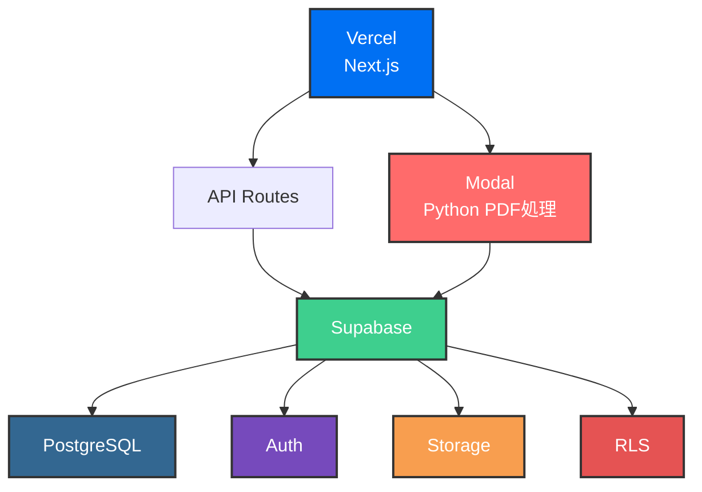

# トクビザ - システムアーキテクチャ

*Supabase × Vercel(Next.js) × Modal(Python) による次世代特定技能採用プラットフォーム*

## プロジェクト概要

トクビザは、特定技能外国人の採用から雇用管理までをワンストップで支援する**完全無料**のSaaSプラットフォームです。

## システム全体アーキテクチャ

## Supabase - バックエンドインフラ

オープンソースのBaaS（Backend as a Service）として、トクビザの基盤を支えています。

### PostgreSQL
  - 特定技能外国人データの安全な保管
  - 高度なクエリ機能による効率的なデータ検索
  - トランザクション管理による整合性保証

### 認証システム
  - 企業・外国人のセキュアなログイン管理
  - OAuth統合（Google、GitHubなど）対応
  - マルチファクタ認証（MFA）サポート

### Row Level Security
  - 企業ごとのデータ分離とセキュリティ
  - 自動的なアクセス制御
  - SQLレベルでのセキュリティ実装

### ストレージ
  - 書類・画像の安全な保管
  - CDN統合による高速配信
  - 自動バックアップ機能

## Next.js - フロントエンドフレームワーク

React基盤の最新フルスタックフレームワークで、高速でSEOに強いアプリケーションを構築。

### App Router
  - 最新のルーティングシステムで直感的なURL設計
  - ファイルベースルーティング
  - 動的ルートとネストレイアウト対応

### Server Components
  - サーバーサイドレンダリングで高速表示
  - クライアントバンドルサイズの削減
  - データフェッチングの最適化

### TypeScript
  - 型安全性による堅牢な開発
  - 開発時エラーの早期発見
  - IDE支援による開発効率向上

### Tailwind CSS
  - 効率的なスタイリングシステム
  - ユーティリティファーストアプローチ
  - レスポンシブデザインの簡易実装

## Vercel - ホスティング&デプロイメント

Next.jsに最適化された高速なデプロイメントプラットフォーム。

### 自動デプロイ
  - GitHubプッシュで即座に本番環境へ反映
  - CI/CDパイプラインの自動実行
  - ロールバック機能付き

### プレビュー環境
  - PRごとに独立した検証環境を自動生成
  - 本番環境と同等の環境で事前確認
  - コメントによる自動通知

### エッジネットワーク
  - 世界中どこからでも高速アクセス
  - 最寄りのエッジロケーションから配信
  - DDoS保護とWAF機能

### Analytics
  - パフォーマンス監視と最適化
  - リアルタイムユーザー分析
  - Core Web Vitals追跡

## Modal - PDF処理専用サーバー

特定技能に必要な40種類以上の書類をPythonで高速自動生成するサーバーレス基盤。

### Python実装
  - PDFライブラリを活用した柔軟な書類生成
  - ReportLabによる高度なレイアウト制御
  - 日本語フォント完全対応

### オンデマンド実行
  - 必要な時だけ起動しコストを最適化
  - コールドスタート最適化
  - 自動スケールイン・アウト

### 高速処理
  - 複雑な書類も数秒で生成完了
  - 並列処理による効率化
  - メモリ最適化によるパフォーマンス向上

### スケーラブル
  - 同時に大量の書類生成リクエストにも対応
  - GPUアクセラレーション対応
  - 分散処理アーキテクチャ

## 技術スタックのメリット

- **開発速度**
  - Supabaseの統合機能とNext.jsのフルスタック機能により、迅速な機能開発が可能
  - リアルタイムデータベース機能による即座な画面更新
  - 豊富なテンプレートとコンポーネントライブラリ

- **スケーラビリティ**
  - VercelとModalの組み合わせで、ユーザー数の増加に自動対応
  - 水平スケーリングによる無限の拡張性
  - ロードバランシングとフェイルオーバー

- **コスト効率**
  - サーバーレスアーキテクチャにより、使った分だけの課金で運用コストを最適化
  - 無料枠での開発・検証環境構築
  - リソース使用量の可視化とコスト予測

- **セキュリティ**
  - Supabaseの RLS とNext.jsの型安全性により、堅牢なシステムを実現
  - 自動SSL/TLS証明書管理
  - OWASP Top 10対策済み