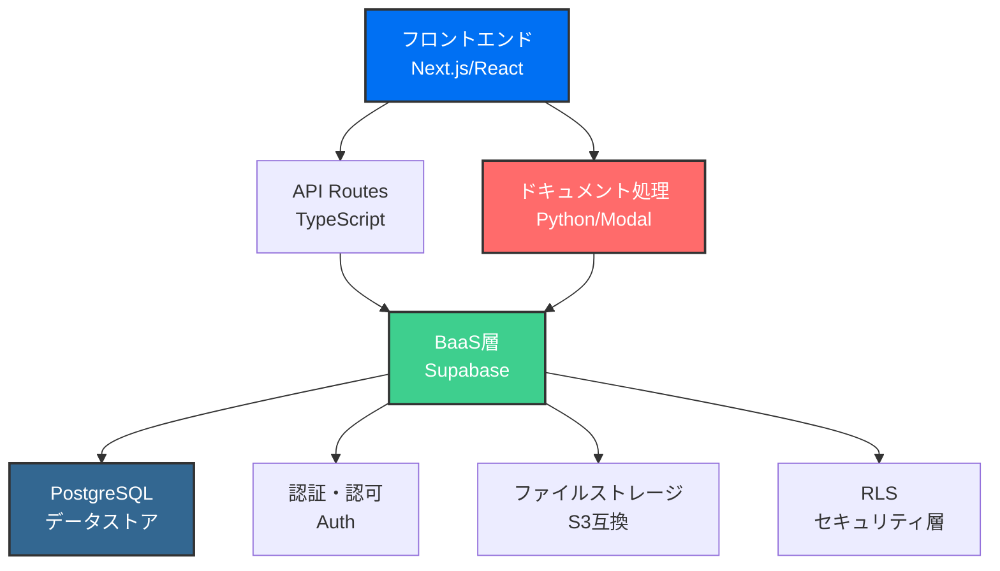

# モダンSaaSプラットフォーム - 技術アーキテクチャ概要

*BaaS × サーバーレス × Pythonによる次世代エンタープライズSaaS*

## プロジェクト概要

当SaaSプラットフォームは、複雑な業務管理プロセスを劇的に効率化し、データドリブンなマッチングを実現する、エンタープライズグレードのソリューションです。無料のSaaSレイヤーでユーザーベースを構築し、その上に高付加価値のマーケットプレイスを展開するビジネスモデルを採用しています。

## 技術スタック選定の背景

### なぜこの技術スタックなのか

1. **開発速度の最大化**
   - Supabaseによるバックエンド機能の即座な利用
   - Next.jsのフルスタック機能による迅速な機能実装
   - 型安全性による大規模開発での保守性確保

2. **スケールへの対応**
   - サーバーレスアーキテクチャによる無限の拡張性
   - 使用量ベースの課金でコスト最適化
   - グローバル展開を見据えたエッジコンピューティング

3. **エンタープライズ要件への対応**
   - Row Level Securityによるマルチテナント対応
   - 監査ログとコンプライアンス機能
   - 高度なセキュリティ要件への準拠

## システムアーキテクチャ



## 技術スタック詳細

### フロントエンド層 - Next.js 14 (App Router)

**採用理由：** 
- React Server Componentsによる最適なパフォーマンス
- ファイルベースルーティングによる直感的な開発
- Vercelとの統合による最高のDX（開発者体験）

**主要技術：**
- **TypeScript**: 型安全性とスケーラビリティ
- **Tailwind CSS**: 高速なUI開発とデザインシステム構築
- **Server Components**: バンドルサイズ削減と初期表示の高速化
- **Streaming SSR**: 段階的なページレンダリング

### バックエンド層 - Supabase (オープンソースBaaS)

**採用理由：**
- PostgreSQLベースの堅牢なデータベース
- リアルタイムサブスクリプション機能
- 組み込みの認証・認可システム

**コア機能：**
- **PostgreSQL 15**: 
  - JSONBによる柔軟なスキーマ設計
  - 高度なインデックス戦略
  - パーティショニングによる大規模データ対応
  
- **Row Level Security (RLS)**:
  - SQLレベルでのマルチテナント分離
  - ポリシーベースのアクセス制御
  - 監査ログの自動生成

- **認証システム**:
  - JWT ベースの認証
  - OAuth2.0プロバイダー統合
  - MFA/2FA サポート
  - セッション管理とリフレッシュトークン

- **ストレージ**:
  - S3互換API
  - 自動画像最適化
  - CDN統合による高速配信

### ドキュメント処理層 - Modal (Python サーバーレス)

**採用理由：**
- Pythonエコシステムの豊富なライブラリ
- GPUアクセラレーション対応
- オンデマンドスケーリング

**技術詳細：**
- **処理エンジン**:
  - ReportLab/PyPDFによるPDF生成
  - Pillowによる画像処理
  - NumPy/Pandasによるデータ処理
  
- **最適化戦略**:
  - 並列処理によるスループット向上
  - メモリプーリングによる効率化
  - キャッシュ戦略による重複処理の削減

### インフラストラクチャ層 - Vercel

**採用理由：**
- Next.jsとのネイティブ統合
- グローバルエッジネットワーク
- 自動スケーリングとフェイルオーバー

**主要機能：**
- **Edge Functions**: 
  - 地理的に分散した処理
  - レイテンシの最小化
  
- **Image Optimization**:
  - 自動フォーマット変換
  - レスポンシブ画像配信
  
- **Analytics & Monitoring**:
  - Real User Monitoring (RUM)
  - Core Web Vitals tracking
  - エラートラッキング統合

## エンジニアリングの挑戦と解決策

### 1. マルチテナントアーキテクチャ

**課題：** 数千の企業アカウントを安全に分離しながら、高いパフォーマンスを維持

**解決策：**
```sql
-- Row Level Security ポリシーの例
CREATE POLICY "tenant_isolation" ON documents
  FOR ALL USING (tenant_id = current_setting('app.current_tenant')::uuid);
```

### 2. リアルタイムデータ同期

**課題：** 複数ユーザー間でのリアルタイムコラボレーション

**解決策：**
- Supabase Realtime によるWebSocket接続
- Conflict-free Replicated Data Types (CRDT) の実装
- 楽観的UIアップデートとロールバック機構

### 3. 大規模ドキュメント処理

**課題：** 40種類以上の複雑なドキュメントを高速生成

**解決策：**
- Modalでの並列処理とキューイング
- テンプレートエンジンの最適化
- インクリメンタル生成とストリーミング

## パフォーマンス最適化

### フロントエンド最適化
- **Code Splitting**: ルートベースの自動分割
- **Prefetching**: 予測的なリソース読み込み
- **Image Lazy Loading**: Intersection Observerによる遅延読み込み
- **Bundle Analysis**: 定期的なバンドルサイズ監視

### バックエンド最適化
- **Database Indexing**: 
  ```sql
  CREATE INDEX idx_documents_tenant_created 
    ON documents(tenant_id, created_at DESC);
  ```
- **Connection Pooling**: PgBouncerによる接続管理
- **Query Optimization**: EXPLAINによる定期的な分析
- **Caching Strategy**: Redis互換キャッシュレイヤー

## セキュリティアーキテクチャ

### 多層防御戦略
1. **ネットワーク層**
   - WAF (Web Application Firewall)
   - DDoS Protection
   - Rate Limiting

2. **アプリケーション層**
   - CSP (Content Security Policy)
   - XSS/CSRF Protection
   - Input Validation & Sanitization

3. **データ層**
   - Encryption at Rest (AES-256)
   - Encryption in Transit (TLS 1.3)
   - Key Management Service統合

## 開発プロセスとツール

### CI/CD パイプライン
```yaml
# GitHub Actions ワークフローの例
- TypeScript型チェック
- ESLint/Prettier
- Jest/Cypress テスト実行
- Lighthouse パフォーマンステスト
- Vercelへの自動デプロイ
```

### 開発環境
- **Local Development**: Docker Composeによる統一環境
- **Hot Module Replacement**: 高速な開発サイクル
- **TypeScript Strict Mode**: 型安全性の最大化
- **Monorepo Structure**: pnpm workspacesによる効率的な管理

## チーム構成への期待

### 必要なスキルセット
1. **フルスタックエンジニア**
   - Next.js/React の実務経験
   - TypeScriptでの大規模開発経験
   - PostgreSQLのパフォーマンスチューニング

2. **バックエンドエンジニア**
   - Python での並列処理実装経験
   - サーバーレスアーキテクチャの理解
   - データベース設計とインデックス戦略

3. **DevOps/SRE**
   - Infrastructure as Code (Terraform等)
   - 監視・アラートシステムの構築
   - セキュリティベストプラクティス

## まとめ

当プラットフォームは、最新の技術スタックを活用し、エンタープライズグレードの要件を満たしながら、スタートアップの機動性を維持する設計となっています。無料SaaS戦略による急速なユーザー獲得と、その基盤上でのマーケットプレイス展開という革新的なビジネスモデルを、堅牢な技術基盤で支えています。

エンジニアリングチームには、この技術スタックを最大限に活用し、ユーザーに価値を提供し続ける挑戦的な環境が待っています。