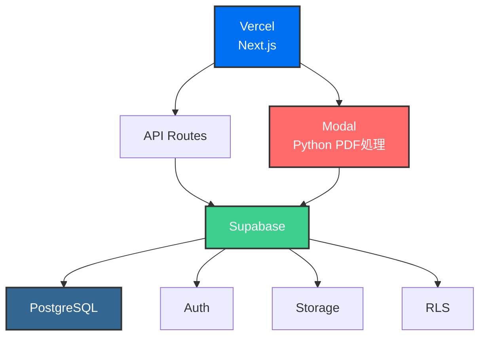

# モダンSaaSプラットフォーム - 技術アーキテクチャ

*Supabase × Vercel(Next.js) × Modal(Python) による次世代エンタープライズSaaS*

## プロジェクト概要

複雑な業務管理を効率化し、データドリブンなマッチングを実現するエンタープライズSaaSプラットフォームです。無料のSaaS機能でユーザーベースを構築し、その上に高付加価値のマーケットプレイスを展開します。

## システムアーキテクチャ

## 技術スタック

### Supabase - バックエンドインフラ
- **PostgreSQL**: 堅牢なデータストレージと高度なクエリ機能
- **認証システム**: JWT認証、OAuth統合、MFA対応
- **Row Level Security**: 企業ごとのデータ分離
- **ストレージ**: S3互換API、CDN統合

### Vercel(Next.js) - フロントエンド&ホスティング
- **App Router**: 最新のファイルベースルーティング
- **Server Components**: 高速な初期表示とSEO最適化
- **TypeScript**: 型安全性による堅牢な開発
- **Tailwind CSS**: 効率的なスタイリング

- **自動デプロイ**: GitHubプッシュで即座に本番反映
- **プレビュー環境**: PRごとの独立した検証環境
- **エッジネットワーク**: グローバル配信とDDoS保護
- **Analytics**: パフォーマンス監視と最適化

### Modal(Python) - ドキュメント処理サーバー
- **Python実装**: 40種類以上の複雑なドキュメント生成
- **オンデマンド実行**: 使用時のみ起動しコスト最適化
- **高速処理**: 並列処理による数秒での生成完了
- **スケーラブル**: 大量の同時リクエストに対応

## 技術的な特徴

### エンタープライズ対応
- マルチテナントアーキテクチャ（RLS）
- 監査ログとコンプライアンス機能
- エンタープライズグレードのセキュリティ

### 開発効率
- TypeScriptによる型安全な開発
- 自動デプロイとプレビュー環境
- モダンな開発ツールチェーン

### スケーラビリティ
- サーバーレスアーキテクチャ
- 使用量ベースの課金
- 水平スケーリング対応

## 必要なスキルセット

**フルスタックエンジニア**
- Next.js/React の実務経験
- TypeScriptでの開発経験
- PostgreSQLの基本的な理解
- Pythonでのバックエンド開発経験

## まとめ

最新の技術スタックを活用し、エンタープライズ要件を満たしながらスタートアップの機動性を維持。無料SaaS + マーケットプレイスという革新的なビジネスモデルを堅牢な技術基盤で実現します。